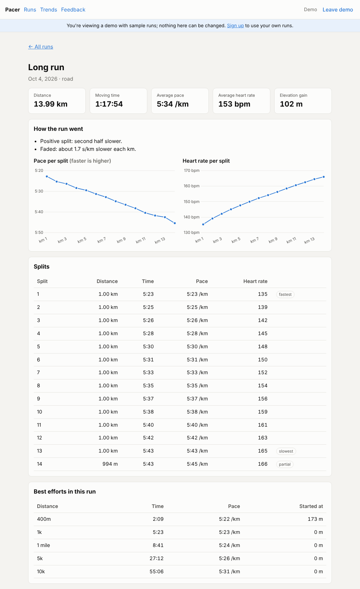
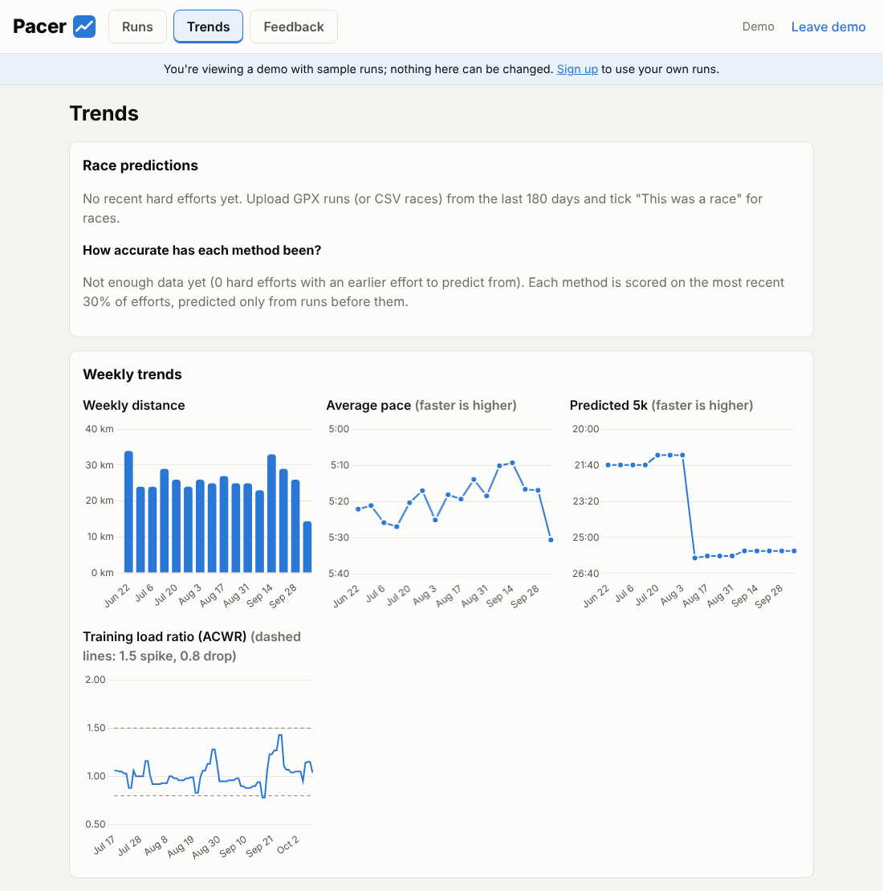
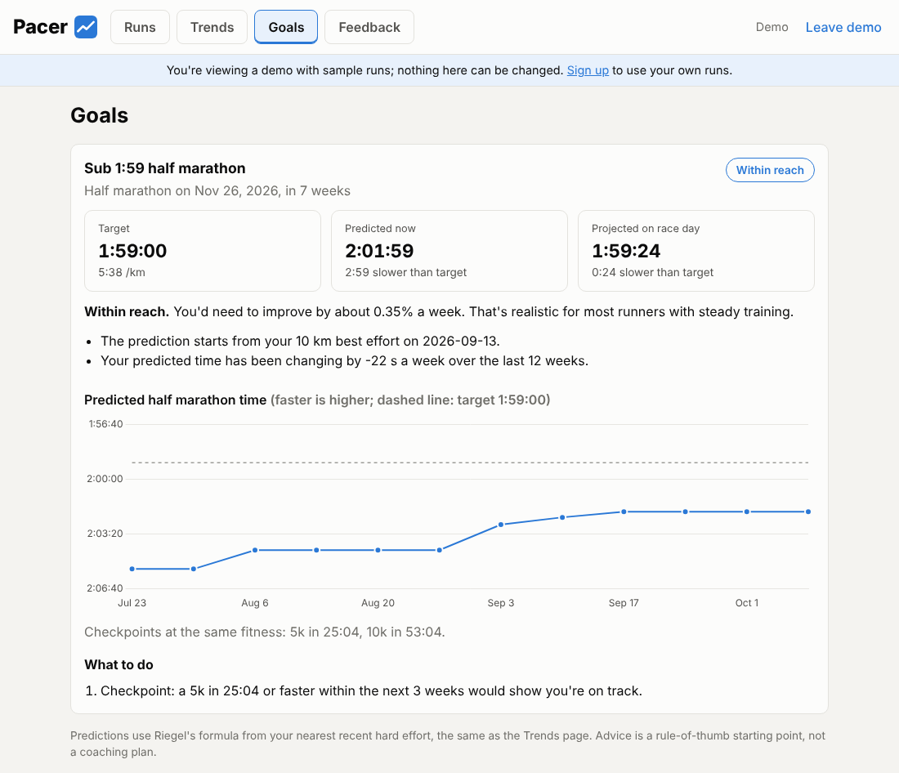

# Pacer

[](https://github.com/DDarrenYe/Pacer/actions/workflows/ci.yml)


Pacer is a running analytics app. Upload a GPX file (or enter a treadmill run by hand) and see your km splits, how much you fade, your best efforts, weekly trends and predicted race times. Set a race goal (say, a sub-2:10 half in November) and Pacer shows where your trend puts you on race day and what to work on.

- **Try it:** https://training-analytics-tool.vercel.app (click **Try the demo** to look around with sample runs, no sign-up needed)
- **API docs:** https://run-analytics-api.onrender.com/docs. It runs on Render's free tier, so the first request after a quiet spell can take up to a minute.
- **Write-ups:** [design decisions and lessons](docs/DECISIONS.md) · [race-prediction model](docs/MODEL.md) · [project plan](docs/PROJECT_PLAN.md)

| Run page | Trends and predictions | Race goals |
|---|---|---|
|  |  |  |

## Built with
Python, FastAPI, SQLAlchemy, Alembic, pandas, NumPy, statsmodels, gpxpy · PostgreSQL (Supabase) · React, TypeScript, Vite, Chart.js · pytest, vitest, Playwright, ruff · GitHub Actions, Render, Vercel.

## API

| Method | Path | Auth | What it does |
|---|---|---|---|
| POST | `/uploads/parse` | – | Parse a GPX/CSV file and return a summary. Nothing is saved. |
| POST | `/runs` | ✔ | Upload a file and save it as a run, with its analytics (409 if you've uploaded it before) |
| GET | `/runs` | ✔ | Your runs, newest first |
| GET | `/runs/{id}` | ✔ | One of your runs, with splits and best efforts |
| POST | `/runs/manual` | ✔ | Enter a run by hand (distance, time, date); pace is calculated |
| PUT | `/runs/{id}/manual` | ✔ | Edit a manual run (uploaded runs come from their file and can't be edited) |
| POST | `/runs/reprocess-all` | ✔ | Recalculate all your uploaded runs |
| POST | `/runs/{id}/reprocess` | ✔ | Redo parsing and analytics from the stored original file |
| DELETE | `/runs/{id}` | ✔ | Delete a run and its stored file |
| GET | `/training-load?days=56` | ✔ | Daily load, 7-day acute, 28-day chronic and ACWR |
| GET | `/trends?weeks=26` | ✔ | Weekly distance, average pace and predicted 5k |
| GET | `/predictions` | ✔ | 5k, 10k, half and marathon predictions by three methods |
| GET | `/predictions/evaluation` | ✔ | Accuracy of each method (MAE, time-ordered test; aggregate only) |
| GET / POST | `/goals` | ✔ | Your race goals, each with predicted time now, projected race-day time and suggestions / add a goal |
| PUT / DELETE | `/goals/{id}` | ✔ | Change or delete a goal |
| GET | `/account` / DELETE `/account` | ✔ | Your run count / delete your account and everything in it |
| POST | `/feedback` | ✔ | Send the developer a note |
| POST | `/demo/session` | – | A 2-hour read-only token for the demo account |
| GET | `/health` | – | Liveness check |

Authenticated routes need a Supabase access token: `Authorization: Bearer <token>`.

## Setup

### 1. Supabase
1. **Database URL:** click **Connect** at the top of the project, choose the **Session pooler** string, and put your database password in it.
2. **Keys:** go to **Project Settings → API Keys** and copy the project URL, the publishable key and the secret key.
3. **Storage:** create a **private** bucket called `raw-uploads`.
4. **Test user:** under **Authentication → Users → Add user**, create one with an email and password.

### 2. Run locally
Keep the project somewhere iCloud doesn't sync, such as `~/Projects`, not Desktop or Documents. iCloud can offload files, which makes Python time out while importing.
```bash
cd backend
python3 -m venv .venv && source .venv/bin/activate
pip install -r requirements-dev.txt
cp .env.example .env        # then fill in the values from step 1
alembic upgrade head        # creates the tables in Supabase
uvicorn app.main:app --reload --reload-dir app
```
The server keeps that Terminal tab busy, so run other commands in a second tab (**Cmd + T**). Activate `.venv` in the new tab first.

Get a token with `python scripts/get_token.py`. Then open http://localhost:8000/docs, click **Authorize**, paste the token, and try `POST /runs`. Tokens last about an hour.

### 3. Run the front end locally
```bash
cd frontend
npm install
cp .env.example .env.local   # set VITE_SUPABASE_URL and VITE_SUPABASE_PUBLISHABLE_KEY
npm run dev                  # http://localhost:5173 (keep the API running too)
```
`npm test` runs the unit tests, and `npm run build` checks types and builds.

### 4. Deploy to Render
On Render, go to **New → Blueprint**, pick this repo and branch, and fill in `DATABASE_URL`, `SUPABASE_URL`, `SUPABASE_SECRET_KEY` and, for legacy projects only, `SUPABASE_JWT_SECRET`. `render.yaml` takes care of the rest, and migrations run automatically on every start. For the demo, set `DEMO_TOKEN_SECRET` to a long random string (`python -c "import secrets; print(secrets.token_urlsafe(48))"`) and run `python scripts/seed_demo.py` once against your database; it's safe to run again. Set `CORS_ORIGINS` to the front end's address, for example `https://your-app.vercel.app,http://localhost:5173`.

### 5. Deploy the front end to Vercel
On Vercel, go to **Add New → Project**, import this repo, set **Root Directory** to `frontend`, and add the three `VITE_*` variables. Point `VITE_API_URL` at the Render URL. `vercel.json` sends every path to the app, so links like `/runs/<id>` work on refresh. In Supabase, go to **Authentication → URL Configuration** and set the Site URL to the Vercel address, so sign-up confirmation emails link back to the app.

## Tests and lint
```bash
cd backend
pytest -q --cov=app                         # SQLite in memory, fake storage; CI requires 94%+ coverage
TEST_DATABASE_URL=postgresql://... pytest   # optional: run against Postgres
ruff check . && ruff format --check .
```
CI runs lint, applies the migrations to a real Postgres 16, checks they match the models, then runs the tests against Postgres.

## Analytics

| Metric | How it's worked out |
|---|---|
| Splits | Every 1 km, or every 400 m when the surface is `track`, using moving time. A leftover under 50 m is added to the last split. |
| Split type | Second half of the distance against the first: more than 1% faster is **negative**, more than 1% slower is **positive**, otherwise **even**. |
| Pace drift | Least-squares slope of split pace against distance, in s/km per km. Positive means slowing down. Needs 3 or more full splits. |
| Best efforts | Fastest 400 m, 1 km, 1 mile, 5 km, 10 km, half and full marathon anywhere in the run (sliding window). |
| Training load | Moving minutes per day. ACWR is the last 7 days divided by the weekly average of the last 28 days: above 1.5 is a spike, below 0.8 is low. Needs 21 days of history. |
| Race prediction | Riegel (1.06), your own fitted exponent, and a pooled regression on all runners. Only hard efforts count. See [docs/MODEL.md](docs/MODEL.md). |
| Goals | Predicted time now, a clamped 12-week trend projected to race day, a status (already there, on track, within reach, stretch), equivalent checkpoint times and rule-based suggestions. See [docs/MODEL.md](docs/MODEL.md#goals). |
| Heart rate | Read from Garmin-style GPX extensions (Strava and Garmin exports) or a CSV `avg_hr` column, and time-weighted. |

## Goals

Add a race on the **Goals** tab: pick a distance (5k, 10k, half, marathon or any distance), a target time and the race date. Each goal gets a card showing:

- **Target, predicted now, and projected on race day**, with how far each is from your target.
- **A status in words:** Already there, On track (your trend gets you there), Within reach (needs up to 0.5% improvement a week) or Stretch.
- **A chart of your predicted race time over the last 12 weeks**, with your target as a dashed line.
- **Checkpoint times:** a 5k and 10k that match the goal, so you can test yourself before race day.
- **What to do:** suggestions for weekly distance, long run, goal-pace practice, training load and taper. Each one quotes the number behind it, e.g. "you've averaged 18 km a week; build towards 30 km".

The projection carries your recent trend forward, but at no more than 1% faster or 0.5% slower a week. With less than 3 weeks of changing predictions, it says there isn't enough history instead of guessing. After race day, a run of about that distance within a day of the date is taken as your result. The thresholds are in [docs/MODEL.md](docs/MODEL.md#goals) and the reasoning is in [docs/DECISIONS.md](docs/DECISIONS.md#after-launch-race-goals).

## Supported files

- **Manual entry:** no file needed. Enter distance, time and date (useful for treadmill runs without a watch). Pace is distance ÷ time, and an implausible pace (faster than 1:30/km or slower than 30:00/km) is rejected as a likely typo. Manual runs count towards weekly distance, trends and training load, and a manual race counts for prediction. They have no splits or best efforts.

- **GPX:** activity exports from a watch or app (the file needs timestamps). Paused points (speed under 0.5 m/s, or a gap of more than 60 s) count toward elapsed time but not moving time. GPS spikes that imply a speed over 12 m/s are dropped. GPS wobble is filtered (distance counts in steps of 5 m or more) and climb uses a 1 m threshold; on a real 15 km run this matches Strava to within 0.1%.
- **CSV:** one row per lap or interval of a single run. It needs a distance column (`distance_m`, `distance_km`, `miles`, or `distance`, which is read as km when every value is 50 or less) and a time column (`time`, `duration`, and so on, in seconds or `mm:ss` / `hh:mm:ss`). An `avg_hr` column is optional. CSVs have no date, so pass `started_at` when you upload. See `backend/tests/data/treadmill.csv`.

## Security notes
- User ids come only from the verified JWT. Both the newer asymmetric (ES256 via JWKS) and legacy HS256 Supabase tokens are supported.
- Row level security is enabled on `runs`, so Supabase's public REST API can't read it. Only this API can.
- Raw files go in a private bucket under `{user_id}/{sha256}`. The secret key never leaves the server.
